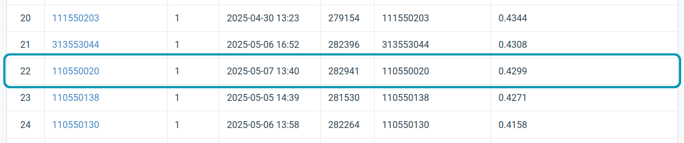
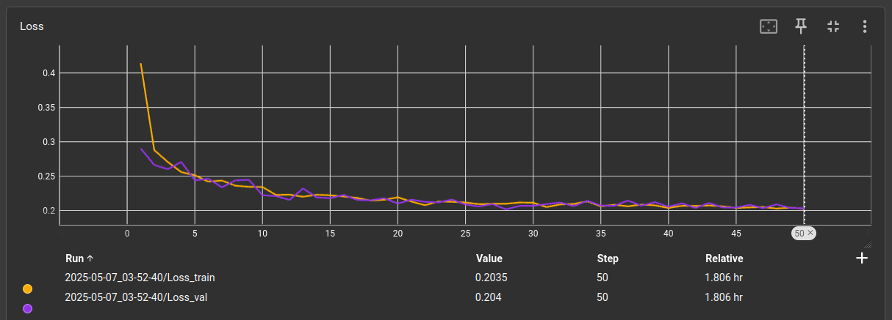

# Instance Segmentation

## Student Information
- **Student ID**: 110550020
- **Name**: Enfu Liao (廖恩莆)

## Description

## Setup and Usage

```bash
pip install -r requirements.txt --index-url https://download.pytorch.org/whl/cu126 --extra-index-url https://pypi.org/simple --break-system-packages
```

```bash
# training
python -m nycu_cv_hw3.train
```

```bash
# inference
python -m nycu_cv_hw3.inference
```

## Repository Structure

```
├── data/                           # Dataset used for training/testing (if applicable)
│   ├── train/                      # Training data (images, masks)
│   ├── test_release/               # Test data (images)
│   └── test_image_name_to_ids.json # Test data (metadata)
├── nycu_cv_hw3/                    # Main package containing source code
├── settings.toml                   # Configuration file for training (e.g., hyperparameters)
├── models/                         # Model
├── outputs/                        # TODO
├── logs/                           # Training history
├── train.log                       # TODO
├── inference.log                   # TODO
├── README.md                       # This file
└── requirements.txt                # Required dependencies
```

## Results



